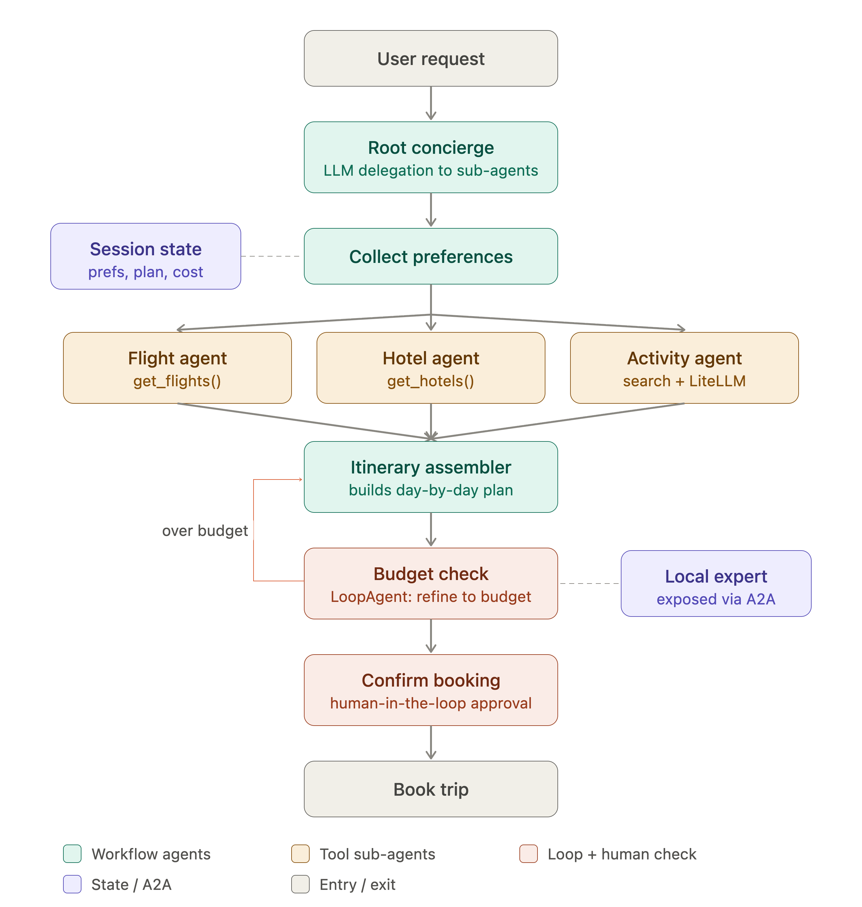

# Trip Planner: a Google ADK live demo

A multi agent trip planner built in nine phases, one ADK concept per phase, one git
branch per phase. Built for a live talk, so every phase runs on mock data and never
depends on a live third party service to succeed.



## Quick start

```bash
python3 -m venv .venv && source .venv/bin/activate
pip install -r requirements.txt
cp .env.example .env      # then paste a Gemini API key into it
adk web agents            # every phase shows up in the dropdown
```

Requires Python 3.10 or newer. Built and demoed on google-adk 2.5.0 with
`gemini-3.6-flash`. That model id was chosen the hard way: see
[docs/MODELS.md](docs/MODELS.md).

**Before a live demo, enable billing on the API key.** The Gemini free tier allows
20 requests per day per model, and one full pipeline run costs 10 to 15. That is
about four runs a day, total. It is the single thing most likely to end the demo.
[docs/RUNBOOK.md](docs/RUNBOOK.md) has the rest.

## The phases

| Branch | Teaches | Folder |
| --- | --- | --- |
| `phase-0-seed` | one Agent, one function tool | `agents/p0_seed` |
| `phase-1-delegation` | sub agents and LLM routing | `agents/p1_delegation` |
| `phase-2-state` | session state and session services | `agents/p2_state` |
| `phase-3-workflow` | Sequential, Parallel and Loop agents | `agents/p3_workflow` |
| `phase-4-tools` | built in and third party tools | `agents/p4_tools` |
| `phase-5-models` | LiteLLM, mixing model providers | `agents/p5_models` |
| `phase-6-safety` | human in the loop confirmation | `agents/p6_safety` |
| `phase-7-a2a` | agent to agent over the wire | `agents/p7_a2a` |
| `phase-8-production` | adk web, adk eval, adk deploy | `agents/p8_production` |

Each branch is cut from the previous one, so `phase-8-production` contains the whole
project. Each phase folder has its own README explaining what changed and why.

## Two extra files per phase

Alongside the agent, most phases ship something you can run **without spending a
model call**, because the best demo is one that cannot flake:

| Phase | Zero cost prop |
| --- | --- |
| 0 | `inspect_tool.py` prints the declaration ADK generated from a docstring |
| 2 | `show_state.py` reads the trip back out of SQLite |
| 3 | `test_budget_loop.py` asserts the loop's exit condition offline |
| 5 | `show_models.py` prints which model every agent runs on |
| 6 | `run_booking.py` drives the approval gate for two or three calls, not fifteen |

One more, which does spend quota because it has to: `measure_cost.py` runs the
pipeline and reports exactly what it cost in calls and tokens, per agent and per
model, read from ADK's own `usage_metadata`. Available from Phase 3 onward.

## Docs

| File | What it is |
| --- | --- |
| [docs/PLAN.md](docs/PLAN.md) | the build plan, verified environment and per phase third party cost |
| [docs/MODELS.md](docs/MODELS.md) | which model ids actually work, and the quota walls |
| [docs/RUNBOOK.md](docs/RUNBOOK.md) | day of the talk checklist and the failure table |
| [docs/check_models.py](docs/check_models.py) | which model ids work and how much quota is left; run `--headroom` the morning of |

## Findings worth a slide

Things this build ran into that are not in the getting started guide:

- `gemini-2.5-flash` returns **404 for new API keys** while still appearing in
  `models.list()`. Listing a model is not proof you can call it.
- The free tier is **20 requests per day, per model**, not just 5 per minute.
- `SequentialAgent`, `ParallelAgent` and `LoopAgent` are **deprecated in ADK 2.5**
  in favour of `Workflow`. Phase 3 ships both so the slide can be accurate.
- `DatabaseSessionService` needs `greenlet`, which nothing pulls in, and needs
  `await service.close()` or your script finishes and never exits.
- The `[a2a]` extra does not pull in `sse-starlette`, and the server dies at
  startup without it.
- A transient 503 with the default retry budget stalls for five minutes with no
  output. Every agent here bounds it to two attempts.
